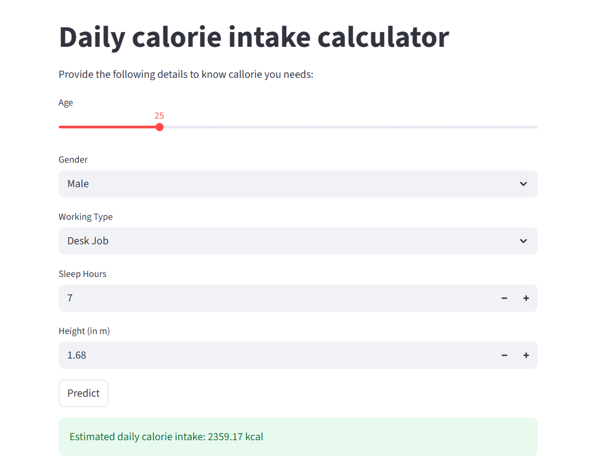

## Calorie Intake Predictor

- In today’s fast-paced world, maintaining a healthy lifestyle is a growing concern. Individuals often struggle to track their daily calorie intake, leading to poor dietary habits and health issues such as obesity, malnutrition, or chronic diseases. There is a need for a user-friendly tool that helps people monitor their calorie consumption based on their personal attributes and lifestyle choices.


### 1) Project Overview:

- The goal of this project is to develop a Calorie Intake Calculator that allows users to input key information such as age, gender, weight, height, activity level, and dietary preferences. Based on this data, the calculator will estimate the recommended daily calorie intake and help users log their meals to track actual consumption. The tool should provide feedback on whether users are meeting, exceeding, or falling short of their daily goals, and offer suggestions for improvement.

## Application Screenshot




## Installation Guide
#### Follow these steps to set up and run the application:

### 1.Clone the Repository:

   ```bash
   git clone https://github.com/sanchit-yadav/Calorie_Intake_Prediction
   ```


### 2.Create a Virtual Environment: Make sure you have a virtual environment set up for your project.

### 3.Install Dependencies: Install the required dependencies using the requirements.txt file:

  
You can copy the following command and run it in your terminal:

```bash
pip install -r requirements.txt
```

I have used file path to load the data use your file path after downloading the data.

#### 4.Run the Application: To start the app, execute the following command in your terminal:
```bash
streamlit run app.py
```